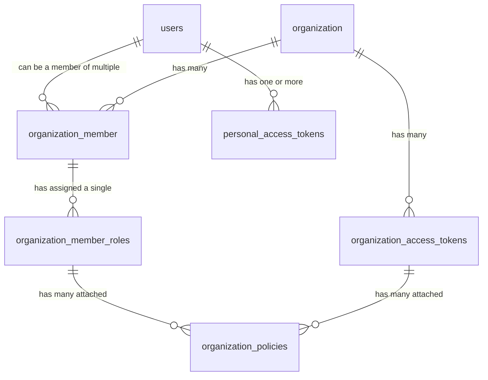

# RFC: Granular Permission System

This RFC proposes a new approach for handling user, organization member, and access tokens (CDN +
target access tokens) to allow resource granularity.

## Problem Statement

Today, our permission and access token system has several shortcomings. Here are a few examples:

- Impossible to limit an access token to only publish a specific service within a target
- Impossible to limit project or target access based on an individual user
- Different types of access tokens (CDN access tokens and registry access tokens)

This has become a inconvenience for organizations that want strict access control to resources
within Hive.

## Goals

- Unification of CDN access tokens and registry tokens as "global" organization scoped access token
- Introduction of personal access tokens
- Granular resource access (inspired by AWS IAM) for both organization member roles and access
  tokens
- Update permissions of access tokens after creation by attaching new policies or updating existing
  policies

## Proposed Solution

### Introducing Policies

Instead of defining permissions for organization member roles, permissions are now defined as
policies. Policies allow granular access to resources and are heavily inspired by AWS IAM.

A policy is a list of statements that will either allow or deny the access to a resource on Hive. If
any of the statements will evaluate to "deny", the actor will not be able to perform a specific
action like publish a schema, view a project or similar.

A statement consists of a `effect` (either `"deny"` or `"allow"`), a action (what specific things
are allowed or denied) and a resource (on which resource are these actions allowed or denied).

For Hive organization administrators, it will be possible to build these policies through either a
policy builder, or by editing raw JSON.

Here are some example statements that serve to show the flexibility and granularity.

**Sample Statement: Allow viewing a specific project**

```json
{
  "effect": "allow",
  "action": "project:view",
  "resource": ["hrn:<organizationId>:project/<projectId>"]
}
```

**Sample Statement: Allow viewing a all projects**

```json
{
  "effect": "allow",
  "action": "project:view",
  "resource": ["hrn:<organizationId>:project/*"]
}
```

**Sample Statement: Allow viewing two specific projects**

```json
{
  "effect": "allow",
  "action": "project:view",
  "resource": [
    "hrn:<organizationId>:project/933007e7-b3f6-4182-8dd5-8d3ce1857b1a",
    "hrn:<organizationId>:project/7b572593-483c-4875-b1bf-4deb60239338"
  ]
}
```

**Sample Statement: Allow publishing new schema version for service on specific federated target**

```json
{
  "effect": "allow",
  "action": "schema:publish",
  "resource": ["hrn:<organizationId>:target/933007e7-b3f6-4182-8dd5-8d3ce1857b1a/<serviceName>"]
}
```

**Sample Statement: Allow publishing new schema version for service on specific federated target**

```json
{
  "effect": "allow",
  "action": "schema:publish",
  "resource": ["hrn:<organizationId>:target/933007e7-b3f6-4182-8dd5-8d3ce1857b1a/*"]
}
```

Each policy will have a list of statements. One or more policies can be attached to either a
organization member role or organization access token.

When updating a policy, the changes will be reflected for all organization members and organization
access tokens that reference such policies.

### Permission overview

The following permissions are planned to be assignable to organization member roles and access
tokens.

#### `organization:describe`

View and retrieve information about a Hive organization.

```json
[
  {
    "effect": "allow",
    "action": "organization:describe",
    "resource": ["hrn:<organizationId>:organization/933007e7-b3f6-4182-8dd5-8d3ce1857b1a"]
  }
]
```

#### `organization:updateSlug`

Update the organization slug that uniquely identifies a organization.

```json
[
  {
    "effect": "allow",
    "action": "organization:updateSlug",
    "resource": ["hrn:<organizationId>:organization/933007e7-b3f6-4182-8dd5-8d3ce1857b1a"]
  }
]
```

#### `organization:delete`

Delete an organization.

```json
[
  {
    "effect": "allow",
    "action": "organization:delete",
    "resource": ["hrn:<organizationId>:organization/933007e7-b3f6-4182-8dd5-8d3ce1857b1a"]
  }
]
```

#### `organization:modifyGitHubIntegration`

View and modify the GitHub integration and grant access to different GitHub repositories.

```json
[
  {
    "effect": "allow",
    "action": "organization:modifyGitHubIntegration",
    "resource": ["hrn:<organizationId>:organization/933007e7-b3f6-4182-8dd5-8d3ce1857b1a"]
  }
]
```

#### `organization:modifySlackIntegration`

View and modify the Slack integration.

```json
[
  {
    "effect": "allow",
    "action": "organization:modifySlackIntegration",
    "resource": ["hrn:<organizationId>:organization/933007e7-b3f6-4182-8dd5-8d3ce1857b1a"]
  }
]
```

#### `organization:modifyOIDC`

View and modify the OIDC integration.

```json
[
  {
    "effect": "allow",
    "action": "organization:modifyOIDC",
    "resource": ["hrn:<organizationId>:organization/933007e7-b3f6-4182-8dd5-8d3ce1857b1a"]
  }
]
```

#### `support:manageTickets`

Create, view and answer support tickets.

```json
[
  {
    "effect": "allow",
    "action": "support:manageTickets",
    "resource": ["hrn:<organizationId>:organization/933007e7-b3f6-4182-8dd5-8d3ce1857b1a"]
  }
]
```

#### `billing:describe`

View billing information.

```json
[
  {
    "effect": "allow",
    "action": "billing:describe",
    "resource": ["hrn:<organizationId>:organization/933007e7-b3f6-4182-8dd5-8d3ce1857b1a"]
  }
]
```

#### `billing:update`

Modify billing information.

```json
[
  {
    "effect": "allow",
    "action": "billing:update",
    "resource": ["hrn:<organizationId>:organization/933007e7-b3f6-4182-8dd5-8d3ce1857b1a"]
  }
]
```

#### `policy:describe`

View the policy statement definitions within an organization.

```json
[
  {
    "effect": "allow",
    "action": "policy:describe",
    "resource": ["hrn:<organizationId>:organization/933007e7-b3f6-4182-8dd5-8d3ce1857b1a"]
  }
]
```

#### `policy:modify`

Modify the policy statement definitions.

```json
[
  {
    "effect": "allow",
    "action": "policy:modify",
    "resource": ["hrn:<organizationId>:organization/933007e7-b3f6-4182-8dd5-8d3ce1857b1a"]
  }
]
```

#### `accessToken:describe`

View the access tokens within an organization.

```json
[
  {
    "effect": "allow",
    "action": "accessToken:describe",
    "resource": ["hrn:<organizationId>:organization/933007e7-b3f6-4182-8dd5-8d3ce1857b1a"]
  }
]
```

#### `accessToken:create`

Create a access token within an organization.

```json
[
  {
    "effect": "allow",
    "action": "accessToken:create",
    "resource": ["hrn:<organizationId>:organization/933007e7-b3f6-4182-8dd5-8d3ce1857b1a"]
  }
]
```

#### `accessToken:delete`

Delete a access token within an organization.

```json
[
  {
    "effect": "allow",
    "action": "accessToken:delete",
    "resource": ["hrn:<organizationId>:organization/933007e7-b3f6-4182-8dd5-8d3ce1857b1a"]
  }
]
```

#### `member:describe`

View and retrieve information about the members within an organization.

```json
[
  {
    "effect": "allow",
    "action": "member:describe",
    "resource": ["hrn:<organizationId>:organization/933007e7-b3f6-4182-8dd5-8d3ce1857b1a"]
  }
]
```

#### `member:assignRole`

Assign roles to members within a organization.

```json
[
  {
    "effect": "allow",
    "action": "member:assignRule",
    "resource": ["hrn:<organizationId>:organization/933007e7-b3f6-4182-8dd5-8d3ce1857b1a"]
  }
]
```

#### `member:modifyRole`

Modify existing member roles and add new permissions.

```json
[
  {
    "effect": "allow",
    "action": "member:modifyRole",
    "resource": ["hrn:<organizationId>:organization/933007e7-b3f6-4182-8dd5-8d3ce1857b1a"]
  }
]
```

#### `member:removeMember`

Remove a user from a organization.

```json
[
  {
    "effect": "allow",
    "action": "member:removeMember",
    "resource": ["hrn:<organizationId>:organization/933007e7-b3f6-4182-8dd5-8d3ce1857b1a"]
  }
]
```

#### `member:manageInvites`

Allow inviting an user to an organization; allow deleting invites; set role for invited user.

```json
[
  {
    "effect": "allow",
    "action": "member:manageInvites",
    "resource": ["hrn:<organizationId>:organization/933007e7-b3f6-4182-8dd5-8d3ce1857b1a"]
  }
]
```

#### `project:create`

Create a new project within an organization.

```json
[
  {
    "effect": "allow",
    "action": "project:describe",
    "resource": ["hrn:<organizationId>:organization/<organizationId>"]
  }
]
```

#### `project:describe`

View and retrieve information about a project within an organization.

```json
[
  {
    "effect": "allow",
    "action": "project:describe",
    "resource": ["hrn:<organizationId>:project/<projectId>"]
  }
]
```

#### `project:delete`

Delete a project within an organization.

```json
[
  {
    "effect": "allow",
    "action": "project:delete",
    "resource": ["hrn:<organizationId>:project/<projectId>"]
  }
]
```

#### `alert:modify`

Modify alerts for a project.

```json
[
  {
    "effect": "allow",
    "action": "alert:modify",
    "resource": ["hrn:<organizationId>:project/<projectId>"]
  }
]
```

#### `project:updateSlug`

Update the organization slug that uniquely identifies a project.

```json
[
  {
    "effect": "allow",
    "action": "project:updateSlug",
    "resource": ["hrn:<organizationId>:project/<projectId>"]
  }
]
```

#### `schemaLinting:manage`

Configure schema policy and linting within a project.

```json
[
  {
    "effect": "allow",
    "action": "schemaLinting:manage",
    "resource": ["hrn:<organizationId>:project/<projectId>"]
  }
]
```

#### `target:create`

Create a new target within a project.

```json
[
  {
    "effect": "allow",
    "action": "target:create",
    "resource": ["hrn:<organizationId>:project/<projectId>"]
  }
]
```

**Example: Allow creating target in any project**

```json
[
  {
    "effect": "allow",
    "action": "target:create",
    "resource": ["hrn:<organizationId>:project/*"]
  }
]
```

**Example: Prevent creating target in single project**

```json
[
  {
    "effect": "allow",
    "action": "target:create",
    "resource": ["hrn:<organizationId>:project/*"]
  },
  {
    "effect": "deny",
    "action": "target:create",
    "resource": ["hrn:<organizationId>:project/<projectId>"]
  }
]
```

#### `target:delete`

Delete a target within a project.

```json
[
  {
    "effect": "allow",
    "action": "target:delete",
    "resource": ["hrn:<organizationId>:target/<targetId>"]
  }
]
```

#### `schemaCheck:create`

Create a schema check within a target.

```json
[
  {
    "effect": "allow",
    "action": "schemaCheck:create",
    "resource": ["hrn:<organizationId>:target/<targetId>"]
  }
]
```

#### `schemaCheck:approve`

Approve a failed schema check within a project.

```json
[
  {
    "effect": "allow",
    "action": "schemaCheck:approve",
    "resource": ["hrn:<organizationId>:target/<targetId>"]
  }
]
```

#### `schemaVersion:publish`

Publish a new schema version within a target.

```json
[
  {
    "effect": "allow",
    "action": "schemaVersion:publish",
    "resource": ["hrn:<organizationId>:target/<targetId>"]
  }
]
```

**Example: Publish only to specific federation service**

```json
[
  {
    "effect": "allow",
    "action": "schemaVersion:publish",
    "resource": ["hrn:<organizationId>:target/<targetId>/service/<serviceName>"]
  }
]
```

#### `appDeployment:create`

Create a app deployment version within a target.

```json
[
  {
    "effect": "allow",
    "action": "appDeployment:create",
    "resource": ["hrn:<organizationId>:target/<targetId>"]
  }
]
```

**Example: Only allow creating an app deployment with a specific app name**

```json
[
  {
    "effect": "allow",
    "action": "appDeployment:create",
    "resource": ["hrn:<organizationId>:target/appDeployment/<appDeploymentName>"]
  }
]
```

#### `appDeployment:publish`

Publish an app deployment version within in a target.

```json
[
  {
    "effect": "allow",
    "action": "appDeployment:publish",
    "resource": ["hrn:<organizationId>:target/<targetId>"]
  }
]
```

**Example: Only allow publishing an app deployment with a specific app name**

```json
[
  {
    "effect": "allow",
    "action": "appDeployment:publish",
    "resource": ["hrn:<organizationId>:target/appDeployment/<appDeploymentName>"]
  }
]
```

#### `laboratory:describe`

View operations in the laboratory.

```json
[
  {
    "effect": "allow",
    "action": "laboratory:describe",
    "resource": ["hrn:<organizationId>:target/<targetId>"]
  }
]
```

#### `laboratory:modify`

Create, update and delete operations

```json
[
  {
    "effect": "allow",
    "action": "laboratory:modifyOperations",
    "resource": ["hrn:<organizationId>:target/<targetId>"]
  }
]
```

#### `cdn:read`

Read artifacts from the Hive CDN.

```json
[
  {
    "effect": "allow",
    "action": "cdn:read",
    "resource": ["hrn:<organizationId>:target/<targetId>"]
  }
]
```

#### `usage:report`

Report schema usage data to the Hive registry.

```json
[
  {
    "effect": "allow",
    "action": "usage:report",
    "resource": ["hrn:<organizationId>:target/<targetId>"]
  }
]
```

### Permission Questions

> Why is there no `target:describe` permissions?

Target data is shared between targets, e.g. usage data for conditional breaking changes, schema
checks and schema publishes. Having granular access to targets would make the whole layer more
complicated than it needs to be. In general, we got the feedback that people want to only limit
access to who can see projects and who can publish a specific service schema/do a specific schema
check for a service. If required, we can later on introduce them.

### Merging CDN access tokens and registry access tokens

In the new permission system, there will no longer be access tokens that belong to one target.
Existing "legacy" registry access tokens will keep working as before.

Any new access token created within the scope of an organization will be an organization access
token, whose permissions are defined via policy statements.

E.g. a statement for a organization access token that can both report usage, but also read a
supergraph from the Hive CDN would look like the following:

```json
{
  "effect": "allow",
  "action": ["usage:report", "cdn:read"],
  "resource": ["hrn:<organizationId>:target/<targetId>"]
}
```

We highly encourage, that organization admins create these sensitive access tokens that are used for
production and CI/CD systems. However, it will be possible to grant organization members access to
create these tokens.

### Personal Access Tokens

Personal access tokens allow users to create access tokens that have a subset of the permissions
their user role provides.

Some examples:

- Pull the latest schema version for local frontend development
- Compose a local GraphQL schema/service with the services published to the Hive schema registry

A organization member can not grant any permissions to the access token that are not covered by the
assigned role to the user.

If an organization members permissions would be downgraded/removed, this change will be
automatically applied in all the access token that user has for this organization.

It will also be possible for organizations to disable personal access tokens if desired.

### ER Diagram



### Implications for CLI Tooling and Usage Reporting

Since access tokens will no longer be tied to a specific target, for new access tokens, it will
become mandatory to provide the organization/project/target path.

**Example: Running a schema check**

```bash
# old command
hive schema:check schema.graphql

# new command
#                 organization / project             / target
hive schema:check the-guild-org/my-federation-project/development schema.graphql
```

For "Legacy" registry access tokens providing this path will remain optional as existing CI/CD setup
shall remain functional.

The same also applies for usage reporting.

For "legacy" registry access tokens, the endpoint will remain the same
(`https://app.graphql-hive.com/usage`), however, new access tokens will also require specifying the
target path (` https://app.graphql-hive.com/usage/the-guild/my-federation-project/development`).

Our CLIs, SDKs, the Gateway, and documentation will be updated accordingly to support both legacy
tokens and the new access tokens.

## Related Issues

- https://github.com/kamilkisiela/graphql-hive/issues/4713
- https://github.com/kamilkisiela/graphql-hive/issues/124
- https://github.com/kamilkisiela/graphql-hive/issues/4713

## Internal Documentation

- https://www.notion.so/theguildoss/New-Hive-Permission-System-113b6b71848a8013bbc7d6ad67d81b43?pvs=4
